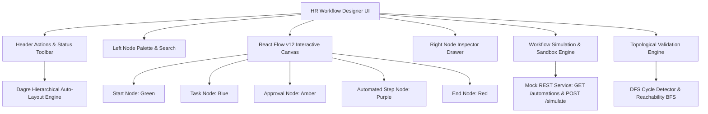

# HR Workflow Designer | Enterprise Automation Engine

An enterprise-grade visual **HR Workflow Designer Module** built with **React, TypeScript, `@xyflow/react` (React Flow v12), and Tailwind CSS**. Designed for HR administrators to visually create, configure, validate, and test complex internal business workflows (such as *Employee Onboarding*, *Leave Approval & Escalation*, and *Document Verification*).

---

## 🚀 Key Highlights & Capabilities

- **5 Specialized Custom Flow Nodes**:
  - 🟢 **Start Node**: Green visual accent, entry trigger badge, dynamic metadata key-value builder.
  - 🔵 **Task Node**: Blue visual accent, assignee chip, due date badge, priority indicators, and custom form fields.
  - 🟡 **Approval Node**: Amber visual accent, approver role selector (`Manager`, `HRBP`, `Director`, `Custom`), auto-approve SLA threshold slider, and dual branching exit ports (`Approved` & `Rejected`).
  - 🟣 **Automated Step Node**: Purple visual accent, mock API integration dropdown (`GET /automations`), and dynamic schema-driven parameter fields.
  - 🔴 **End Node**: Rose/Red visual accent, termination message, and audit summary report toggle.
- **Interactive Sandbox & Mock Execution Engine**:
  - Asynchronous mock API simulation (`POST /simulate`).
  - Live execution timeline with status badges (`Pending`, `Running`, `Success`, `Failed`), SLA durations, output variable state tracking, and animated canvas active-node illumination.
- **Graph Topology & Validation Engine**:
  - Live topological verification for Start/End node invariants.
  - Orphan, dead-end, and unreachable node detection.
  - Depth-First Search (DFS) circular dependency and infinite loop detection.
  - Workflow Health Check dashboard with 1-click **Focus Node** navigation.
- **Bonus Capabilities**:
  - 📁 **JSON Export / Import**: 1-click JSON file download, clipboard sharing, and drag-and-drop file import with schema validation.
  - 📋 **Preset HR Templates**: Instant loading for *Employee Onboarding*, *Paid Time Off (PTO) & Leave Escalation*, and *Document Verification*.
  - 🔄 **Undo / Redo Time Travel**: Full history state stack with keyboard shortcuts (`Ctrl+Z`, `Ctrl+Y`, `Ctrl+Shift+Z`).
  - 📐 **Dagre Auto-Layout Engine**: 1-click hierarchical graph auto-formatting for Horizontal (`LR`) and Vertical (`TB`) alignments.
  - 🗺️ **MiniMap & Interactive Controls**: Color-coded node dots, zoom, fit-view, and canvas panning.

---

## 🏛️ System Architecture



---

## 📂 Project Folder Structure

```
frontend/
├── public/
├── src/
│   ├── components/
│   │   ├── canvas/
│   │   │   └── WorkflowCanvas.tsx         # React Flow canvas wrapper & drag-drop handler
│   │   ├── export/
│   │   │   └── ExportImportModal.tsx      # JSON download, clipboard & upload parser
│   │   ├── inspector/
│   │   │   ├── NodeInspector.tsx          # Dynamic slide-over inspector drawer
│   │   │   └── forms/
│   │   │       ├── StartNodeForm.tsx      # Start node metadata & trigger form
│   │   │       ├── TaskNodeForm.tsx       # Task node form with custom fields builder
│   │   │       ├── ApprovalNodeForm.tsx   # Approval role & SLA slider form
│   │   │       ├── AutomatedStepNodeForm.tsx # Dynamic schema-driven API params form
│   │   │       ├── EndNodeForm.tsx        # Termination message & summary toggle
│   │   │       └── KeyValueEditor.tsx     # Reusable dynamic key-value list editor
│   │   ├── layout/
│   │   │   ├── AppLayout.tsx              # Main application shell
│   │   │   ├── Header.tsx                 # Header toolbar with undo/redo/layout/test actions
│   │   │   └── Sidebar.tsx                # 5-node draggable palette with search
│   │   ├── nodes/
│   │   │   ├── StartNode.tsx              # Custom Green start node
│   │   │   ├── TaskNode.tsx               # Custom Blue task node
│   │   │   ├── ApprovalNode.tsx           # Custom Amber approval node with dual ports
│   │   │   ├── AutomatedStepNode.tsx      # Custom Purple API step node
│   │   │   ├── EndNode.tsx                # Custom Red termination node
│   │   │   └── index.ts                   # Node component exports & React Flow nodeTypes
│   │   ├── sandbox/
│   │   │   └── SandboxModal.tsx           # Mock execution stepper, logs, & JSON viewer
│   │   ├── templates/
│   │   │   └── TemplatesModal.tsx         # Pre-built HR workflow catalog modal
│   │   └── validation/
│   │       └── ValidationModal.tsx        # Workflow Health Check & diagnostic dashboard
│   ├── hooks/
│   │   └── useWorkflowStore.ts            # State management, undo/redo, mutations
│   ├── services/
│   │   ├── api.ts                         # Mock REST endpoints (/automations, /simulate)
│   │   └── mockApi.ts                     # Fallback schema and simulation utilities
│   ├── types/
│   │   └── workflow.ts                    # TypeScript data models and node interfaces
│   ├── utils/
│   │   ├── autoLayout.ts                  # Dagre hierarchical layout engine (LR / TB)
│   │   ├── graphValidation.ts             # Topological cycle detection & schema validation
│   │   └── templateWorkflows.ts           # Pre-configured HR workflow templates
│   ├── App.tsx                            # Root application component
│   ├── index.css                          # Theme design tokens, scrollbars, animations
│   └── main.tsx                           # Application entry point
├── package.json
├── tsconfig.json
└── vite.config.ts
```

---

## 🛠️ Tech Stack & Architectural Decisions

| Technology | Selection Rationale |
| :--- | :--- |
| **Vite 6** | Ultra-fast Hot Module Replacement (HMR) and optimized rollup production bundles. |
| **React 18 + TypeScript** | Strict type safety across all graph nodes, edges, validation errors, and API schemas. |
| **`@xyflow/react` (v12)** | Industry-standard flowcharting engine offering custom handles, smooth panning/zooming, and custom node renderers. |
| **Tailwind CSS v4** | Rapid, highly maintainable design system with neutral SaaS slate tokens, high-contrast visual accents, and responsive layouts. |
| **Dagre (`dagre`)** | Deterministic directed graph layout engine providing clean horizontal and vertical hierarchical formatting. |
| **Lucide Icons** | Clean, consistent enterprise icon system for all node categories and toolbar actions. |

---

## ⚡ Getting Started

### 1. Prerequisites
- **Node.js**: v18.0.0 or higher (v20+ recommended)
- **npm**: v9.0.0 or higher

### 2. Installation
```bash
# Navigate to the frontend directory
cd frontend

# Install all dependencies
npm install
```

### 3. Development Server
```bash
npm run dev
```
Open your browser at `http://localhost:5173`.

### 4. Production Build & Verification
```bash
npm run build
npm run preview
```

---

## 📋 Features & Requirement Specifications Checklist

| Requirement | Specification | Status |
| :--- | :--- | :---: |
| **Start Node** | Green accent (`#10b981`), Start Title, Metadata key-values | ✅ Complete |
| **Task Node** | Blue accent (`#3b82f6`), Required Title, Description, Assignee, Due Date, Custom Fields | ✅ Complete |
| **Approval Node** | Amber accent (`#f59e0b`), Title, Approver Role, Auto-approve SLA threshold, Dual outcome exit handles | ✅ Complete |
| **Automated Step Node** | Purple accent (`#a855f7`), Action dropdown (`GET /automations`), Dynamic parameter schema inputs | ✅ Complete |
| **End Node** | Red accent (`#ef4444`), End message, Summary flag boolean toggle switch | ✅ Complete |
| **Mock API: `/automations`** | Asynchronous endpoint returning action catalog with typed parameters | ✅ Complete |
| **Mock API: `/simulate`** | Graph JSON serializer with step-by-step trace generation, timings, and variable resolution | ✅ Complete |
| **Topological Validation** | Start/End count checks, DFS cycle detection, orphan/dead-end detection, inline badges | ✅ Complete |
| **Undo / Redo History** | Full state time-travel stack with `Ctrl+Z` / `Ctrl+Y` shortcuts | ✅ Complete |
| **Dagre Auto-Layout** | One-click Horizontal (`LR`) and Vertical (`TB`) hierarchical graph formatting | ✅ Complete |
| **Preset HR Templates** | Onboarding, Leave Approval & Escalation, Document Verification templates | ✅ Complete |
| **Export / Import JSON** | File download, clipboard copy, and file/text schema imports with validation | ✅ Complete |
| **MiniMap & Canvas Controls** | Color-coded MiniMap, Zoom In/Out, Fit-View, interactive dragging | ✅ Complete |

---

## 👩‍💻 Author & Overview

- **Developer**: Tejaswani
- **Role**: Full Stack Engineer Assessment
- **Company**: Tredence Analytics
- **Repository**: [https://github.com/Tejaswani645/tredence-hr-workflow-designer](https://github.com/Tejaswani645/tredence-hr-workflow-designer)
