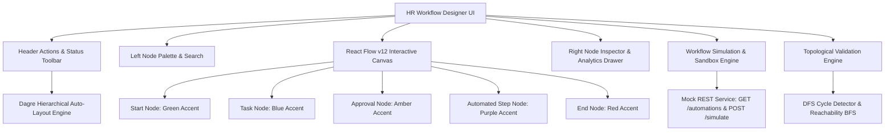

# HR Workflow Designer | Enterprise Automation Engine

An enterprise-grade visual **HR Workflow Designer Module** built with **React, TypeScript, `@xyflow/react` (React Flow v12), and Tailwind CSS**. Designed for HR administrators to visually create, configure, validate, and simulate complex internal business workflows (such as *Employee Onboarding*, *Leave Approval & Escalation*, and *Document Verification*).

---

## 🏛️ Architecture & System Design

The module is architected around a unidirectional reactive state model combining React Flow's graph orchestration with an asynchronous mock backend layer and real-time graph topology validator.



### Folder Structure
```
frontend/
├── src/
│   ├── components/
│   │   ├── analytics/
│   │   │   └── WorkflowAnalyticsDrawer.tsx # Real-time metrics & automation coverage
│   │   ├── canvas/
│   │   │   └── WorkflowCanvas.tsx         # React Flow canvas wrapper & drag-drop handler
│   │   ├── export/
│   │   │   └── ExportImportModal.tsx      # JSON download, clipboard & upload parser
│   │   ├── inspector/
│   │   │   ├── NodeInspector.tsx          # Dynamic slide-over inspector drawer
│   │   │   └── forms/                     # Specialized config forms per node type
│   │   ├── layout/
│   │   │   ├── AppLayout.tsx              # Main application shell with Theme support
│   │   │   ├── Header.tsx                 # Header toolbar with undo/redo/layout/test actions
│   │   │   └── Sidebar.tsx                # 5-node draggable palette with search
│   │   ├── nodes/                         # 5 Custom flow nodes (Start, Task, Approval, Automated, End)
│   │   ├── sandbox/
│   │   │   └── SandboxModal.tsx           # Mock execution stepper, logs, & JSON viewer
│   │   ├── templates/
│   │   │   └── TemplatesModal.tsx         # Pre-built HR workflow catalog modal
│   │   └── validation/
│   │       └── ValidationModal.tsx        # Workflow Health Check & diagnostic dashboard
│   ├── hooks/
│   │   └── useWorkflowStore.ts            # State management, undo/redo, mutations
│   ├── services/
│   │   └── api.ts                         # Mock REST endpoints (/automations, /simulate)
│   ├── types/
│   │   └── workflow.ts                    # TypeScript data models and node interfaces
│   ├── utils/
│   │   ├── autoLayout.ts                  # Dagre hierarchical layout engine (LR / TB)
│   │   ├── graphValidation.ts             # Topological cycle detection & schema validation
│   │   └── templateWorkflows.ts           # Pre-configured HR workflow templates
│   ├── App.tsx                            # Root application component
│   ├── index.css                          # Theme design tokens (Dark/Light), scrollbars, animations
│   └── main.tsx                           # Application entry point
```

---

## ⚡ How to Run

### 1. Prerequisites
- **Node.js**: v18.0.0 or higher (v20+ recommended)
- **npm**: v9.0.0 or higher

### 2. Installation
```bash
# Navigate to the frontend project directory
cd frontend

# Install all dependencies
npm install
```

### 3. Run Development Server
```bash
npm run dev
```
Open your browser at `http://localhost:5173`.

### 4. Build for Production & Typecheck
```bash
npm run build
npm run preview
```

---

## 🧠 Design Decisions & Trade-offs

1. **State Management (`useWorkflowStore`)**:
   - *Decision*: Built a centralized custom hook using standard React state hooks with immutable snapshot history.
   - *Rationale*: Avoids heavy third-party state libraries while providing zero-boilerplate Undo/Redo state time travel (`past` and `future` stacks) and instant reactivity between the Canvas, Inspector, and Analytics drawers.

2. **React Flow v12 (`@xyflow/react`)**:
   - *Decision*: Upgraded to the modern `@xyflow/react` v12 package for node rendering.
   - *Rationale*: Native support for dynamic handles, sub-pixel rendering performance, viewport-to-flow coordinate projection for drag-and-drop, and rich accessibility controls.

3. **Dynamic Schema-Driven Form Generation (Automated Step Node)**:
   - *Decision*: Rather than hardcoding forms for automated steps, the parameter form fields are generated dynamically based on the schema returned by `GET /automations`.
   - *Rationale*: New automation actions can be added to the backend catalog without requiring UI code changes.

4. **Dual Branching Approval Gate Ports**:
   - *Decision*: The `ApprovalNode` exposes two distinct output ports (`approved` in emerald and `rejected` in rose) rather than a single ambiguous handle.
   - *Rationale*: Real HR business processes require distinct routing paths for approvals and rejections/escalations.

5. **Topological Graph Validation Engine (DFS Cycle Detection)**:
   - *Decision*: Built a client-side topology validator using Depth First Search (DFS) recursion with 3-state coloring (unvisited, visiting, visited) and Breadth First Search (BFS) reachability.
   - *Rationale*: Instant user feedback on circular dependencies, dead-ends, or orphan nodes before executing simulation.

6. **Light & Dark Theme Engine**:
   - *Decision*: Implemented CSS variable theme tokens toggled via a high-contrast theme switch.
   - *Rationale*: Accommodates both executive dashboard presentations (modern light mode matching Tredence UI Reference 1) and focused developer work (dark mode).

---

## 📊 Completed Features vs. What I Would Add With More Time

### ✅ What Was Completed:
- **5 Custom Node Types**: Start (Green), Task (Blue), Approval (Amber), Automated Step (Purple), and End (Red) with full inspector forms.
- **Mock API Layer**: Asynchronous `GET /automations` and `POST /simulate` endpoints with execution latency and state resolution.
- **Interactive Sandbox Stepper**: Step-by-step trace playback, active node pulsing, traversed edge glow, variable inspection, and telemetry logs.
- **Topological Validator**: Live cycle detection (DFS), Start/End count rules, orphan/dead-end detection, and 1-click **Focus Node** modal.
- **Bonus Capabilities**:
  - 📁 JSON Export & Import (download, clipboard, drag-drop file upload, text paste).
  - 📋 3 Pre-built HR Templates (Onboarding, Leave Approval & Escalation, Document Verification).
  - 🔄 Canvas Undo / Redo history with keyboard shortcuts (`Ctrl+Z`, `Ctrl+Y`).
  - 📐 Dagre hierarchical Auto-Layout for Horizontal (`LR`) and Vertical (`TB`) formatting.
  - 🗺️ Color-coded MiniMap, Zoom In/Out, and Fit-View controls.
  - 📈 Workflow Analytics & Performance Overview Drawer (Automation Coverage %, Node Distribution, Graph Health).

### 🚀 What I Would Add With More Time:
1. **Real-time Multi-User Collaboration**:
   - Integrate WebSockets and CRDTs (e.g., Yjs / Liveblocks) so multiple HR administrators can edit and annotate workflows concurrently with live cursor presence.
2. **Dynamic Expression & Condition Builder**:
   - Add a visual rule builder (e.g., JSONLogic / CEL) for custom condition nodes (e.g., `if employee.salary > 100000 AND department === 'Exec'`).
3. **Live HRIS & Webhook Integrations**:
   - Connect actual third-party OAuth2 integrations (Workday, BambooHR, Slack, DocuSign, Gusto) with test webhooks.
4. **BPMN 2.0 / Temporal Export**:
   - Support standard BPMN 2.0 XML or Temporal.io workflow code generation from the visual graph.
5. **Node Grouping & Sub-Workflows**:
   - Support nested sub-processes (collapsible composite nodes) for large enterprise workflows with 50+ steps.

---

## 👩‍💻 Author & Overview

- **Developer**: Tejaswani
- **Role**: Full Stack Engineer Assessment
- **Company**: Tredence Analytics
- **Repository**: [https://github.com/Tejaswani645/tredence-hr-workflow-designer](https://github.com/Tejaswani645/tredence-hr-workflow-designer)
